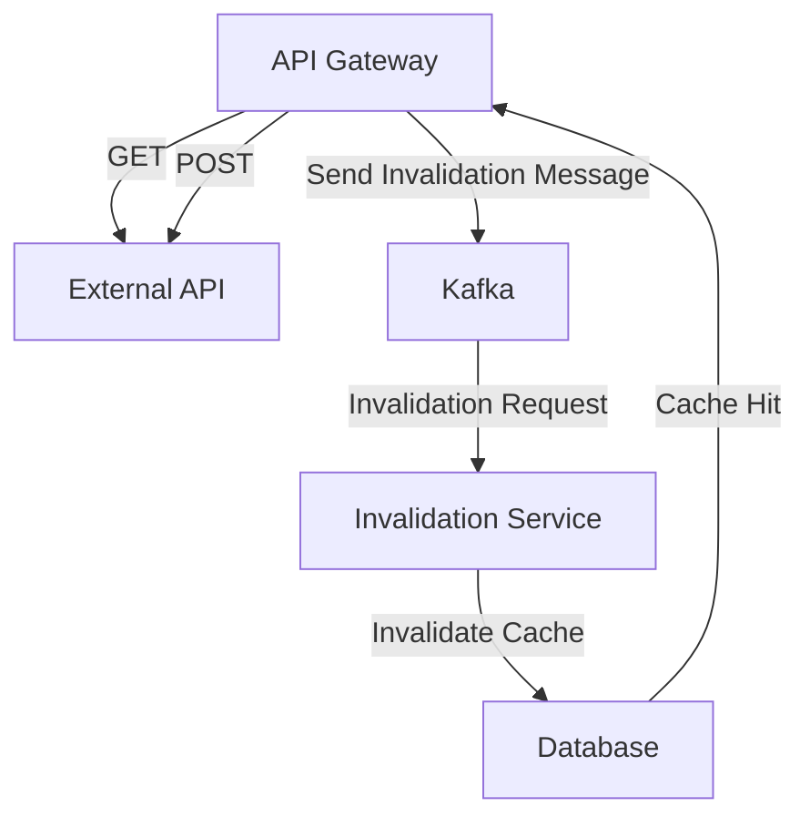

  
  <h1>VIVO Challange</h1>
  
Solução para o desafio proposto pela VIVO

## Descrição

A Vivo possui uma API que consome dados de outros serviços via HTTP. Esse projeto busca trazer maior resiliência e performance para o sistema através de novos componentes na infraestrutura atual do sistema e alterações a nível de design de sistemas.
 
## Solução

Propomos uma solução baseada em caching dos dados disponibilizados pela API com uma estratégia elegante de invalidação para manter os dados atualizados. Isso alcança a performance e resiliência que a API da Vivo precisa.

## Arquitetura

Para a solução proposta, a arquitetura do sistema foi dividida em 5 componentes principais:

- **API Gateway**: Responsável por receber as requisições dos clientes e encaminhá-las para o serviço correto.

- **Database**: Armazena os dados que são consumidos das APIs externas como uma forma de cache.

- **External API**: APIs externas que fornecem os dados que a API da Vivo consome.

- **Kafka**: Fila de mensagens que é utilizada para enviar mensagens de invalidação para o serviço de invalidação.

- **Invalidation Service**: Serviço que recebe as mensagens de invalidação e invalida os dados no cache asincronamente.

## Tecnologias

- **API Gateway**: API feita em Node.js com Express.js.

- **Database**: PostgreSQL

- **External API**: API feita em Node.js com Express.js.

- **Kafka**: Apache Kafka

- **Invalidation Service**: API feita em Node.js com Express.js.
